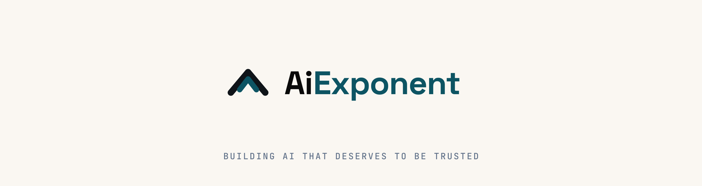
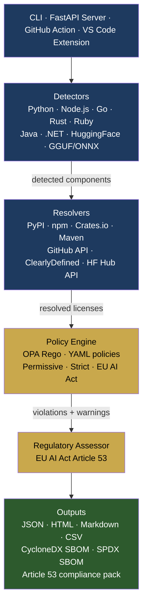
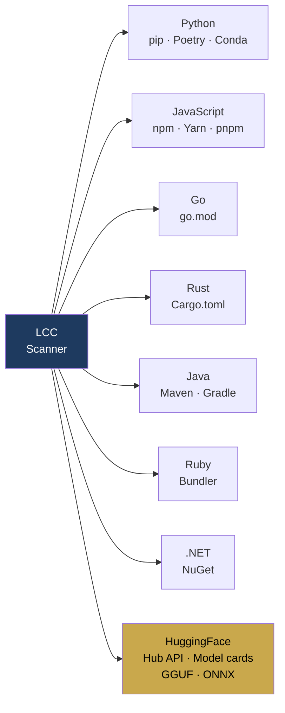
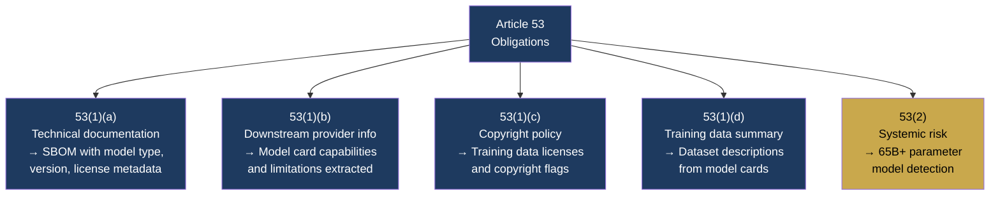

<p align="center">
  <a href="https://aiexponent.com"></a>
</p>

<h1 align="center">License Compliance Checker (LCC)</h1>
<p align="center"><em>Know what you ship. Know what you owe.</em></p>

<p align="center">
  <a href="https://pypi.org/project/license-compliance-checker/"></a>
  <a href="https://github.com/aiexponenthq/license-compliance-checker/actions"></a>
  <a href="LICENSE"></a>
  <a href="https://www.python.org/downloads/"></a>
  <a href="https://eur-lex.europa.eu/legal-content/EN/TXT/?uri=CELEX:32024R1689"></a>
  <a href="#privacy"></a>
</p>

---

The only open-source scanner that combines dependency license detection, AI model license analysis, and EU AI Act Article 53 compliance — in a single tool.

Built by [AI Exponent LLC](https://aiexponent.com). Free and open source under Apache 2.0.

---

## Quick Start

```bash
pip install license-compliance-checker

# Scan a project
lcc scan .

# Scan with EU AI Act compliance policy
lcc scan . --policy eu-ai-act-compliance --format json

# Generate a CycloneDX SBOM
lcc sbom generate scan-report.json --format cyclonedx --output sbom.json

# Check GPL contamination in a SaaS context
lcc scan . --project-license Apache-2.0 --context saas
```

---

## What LCC does

- AI model license detection, including HuggingFace models resolved by Hub ID and GGUF / ONNX model files
- EU AI Act Article 53 assessment and compliance-pack output
- A training-data risk registry that flags datasets with commercial-use restrictions
- SBOM generation in CycloneDX and SPDX
- Policy-as-code with OPA Rego or YAML policies
- Free and open source under Apache-2.0

---

## Architecture



---

## Ecosystem Coverage



---

## EU AI Act Article 53 Coverage

GPAI obligations under Article 53 have applied since **2 August 2025** for models placed on the market from that date; models placed earlier must comply by 2 August 2027. The Commission's supervision and enforcement powers, including fines, begin **2 August 2026**. LCC automates evidence gathering for each sub-obligation:



> **Scope note:** LCC generates audit evidence for Article 53 documentation obligations. It is not a legal compliance determination. Involve qualified legal counsel for final compliance assessment.

> **Penalty band:** Non-compliance with Article 53 is sanctionable by the Commission under **Article 101(1)** at up to **€15M or 3% of global annual turnover**, whichever is higher. Note that GPAI fines are Commission-imposed under Art. 101 — distinct from the Art. 99 fines imposed by member-state market-surveillance authorities for high-risk-system violations. Source: [Regulation (EU) 2024/1689, Art. 101(1)](https://eur-lex.europa.eu/legal-content/EN/TXT/?uri=CELEX:32024R1689).

---

## AI Model Detection

LCC scans your codebase for AI model references without requiring a local download:

```bash
# Detects from_pretrained("org/model") references in Python / YAML / JSON
lcc scan .

# Detects GGUF and ONNX model files (Ollama / llama.cpp)
lcc scan /path/to/models

# Full transitive scan with lock file
lcc scan . --include-transitive --policy permissive
```

**Supported AI license families:** the OpenRAIL family (including BigScience BLOOM and CreativeML variants), Llama 2 / 3 / 3.1, Gemma, and Mistral, plus provider licenses from Anthropic, OpenAI, Cohere, and AI21. The registry holds 17 AI license definitions and also recognises standard SPDX identifiers.

**Training data risk registry:** Flags datasets with commercial use risk — OpenAI API outputs, ShareGPT, Books3, The Pile classified as high/critical risk.

---

## Policy Enforcement

```bash
# Built-in policies
lcc scan . --policy permissive            # Allow MIT, Apache-2.0, BSD only
lcc scan . --policy strict                # Block all copyleft
lcc scan . --policy eu-ai-act-compliance  # Article 53 GPAI obligations

# Custom policy (YAML)
cat > my-policy.yaml << EOF
name: my-saas-policy
rules:
  - license: GPL-3.0
    action: block
    reason: "GPL-3.0 requires SaaS source disclosure"
  - license: AGPL-3.0
    action: block
  - license: RAIL
    action: warn
    reason: "Review RAIL restrictions before deploying"
EOF

lcc scan . --policy my-policy.yaml
```

---

## CI/CD Integration

```yaml
# .github/workflows/license-check.yml
- name: License compliance scan
  uses: aiexponenthq/license-compliance-checker/.github/actions/license-compliance@v1
  with:
    path: .
    policy: eu-ai-act-compliance
    fail-on: violations
    format: json
    output: license-report.json
```

---

## SBOM Generation

```bash
# CycloneDX 1.5 with EU AI Act regulatory extensions
lcc sbom generate scan-report.json --format cyclonedx --output sbom.cdx.json

# SPDX 2.3
lcc sbom generate scan-report.json --format spdx --output sbom.spdx.json

# Sign with GPG for tamper-evidence
lcc sbom sign sbom.cdx.json --key ~/.gnupg/key.gpg
```

---

## Known Limitations

- HuggingFace Hub API scanning requires referenced model IDs (not local downloads only).
- SPDX `AND`/`OR` compound expressions are flagged for manual review, not auto-resolved.
- Transitive dependency resolution requires a lock file (`poetry.lock`, `package-lock.json`).
- Article 53 assessment covers documentation completeness only — not a legal compliance determination.
- Training data risk registry covers top-50 known datasets; unknown datasets flagged for review.

---

## Contributing

See [CONTRIBUTING.md](CONTRIBUTING.md). Issues and PRs welcome.

```bash
git clone https://github.com/aiexponenthq/license-compliance-checker
cd license-compliance-checker
pip install -e ".[dev]"
pytest
```

---

## License

[Apache 2.0](LICENSE) — free to use, modify, and distribute.

Built by [AI Exponent LLC](https://aiexponent.com) — `hello@aiexponent.com`

---

*Part of the AiExponent open-source AI governance toolchain:
**license-compliance-checker** ·
[rag-benchmarking](https://github.com/aiexponenthq/rag-benchmarking) ·
[RiskForge](https://github.com/aiexponenthq/riskforge)*
