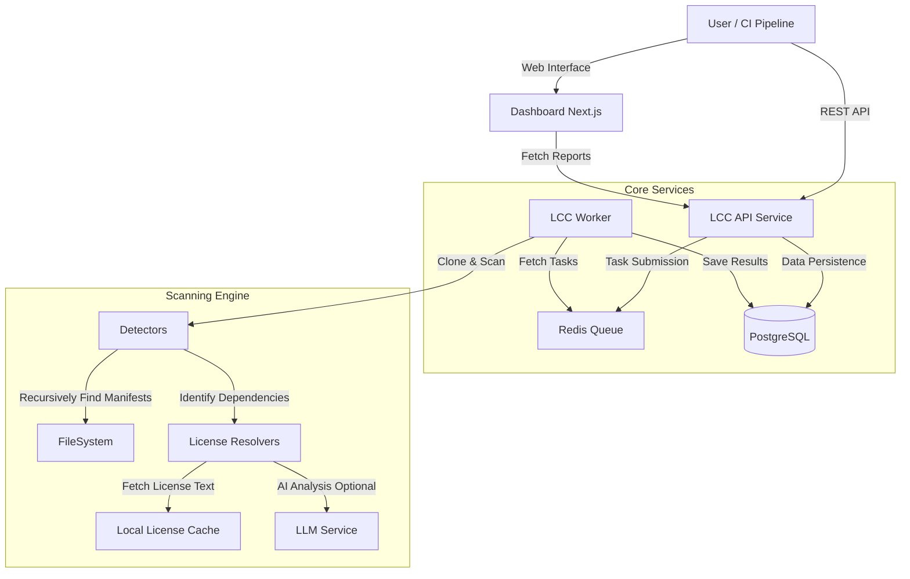

# License Compliance Checker (LCC)

[](LICENSE)
[](pyproject.toml)
[](https://github.com/apundhir/license-compliance-checker/actions/workflows/ci.yml)
[](CONTRIBUTING.md)

**Automated License Compliance for the AI Era.**

LCC is an enterprise-grade, open-source compliance platform designed to secure your software supply chain. It automates license detection, policy enforcement, and compliance reporting across complex polyglot repositories, with first-class support for AI/ML models and datasets.

## Why LCC?

In the age of AI and modular software, dependency chains are exploding. Manual compliance reviews effectively halt development velocity. LCC solves this by:

- **Reducing Risk**: Instantly identifying GPL/AGPL contamination in proprietary codebases.
- **Saving Time**: Automating Bill of Materials (SBOM) and attribution generation.
- **AI-Native**: Interpreting complex AI model licenses (e.g., Llama 2, OpenRAIL) that traditional tools miss.

## Key Features

- **Multi-Language Detection**: Recursively scans Python, JavaScript/TypeScript, Go, Java/Maven, Gradle, Rust/Cargo, Ruby, and .NET projects, including monorepos and nested structures.
- **AI/ML Model & Dataset Scanning**: First-class support for HuggingFace model cards and dataset licenses.
- **License File Detection**: Automatically discovers and classifies standalone LICENSE, COPYING, and NOTICE files.
- **Automated Policy Enforcement**: Define and enforce compliance policies using OPA (Open Policy Agent) or built-in rules, with a full policy testing framework.
- **SBOM Generation**: Produce CycloneDX and SPDX Software Bill of Materials with GPG signing and validation.
- **Security Vulnerability Scanning**: Integrated OSV (Open Source Vulnerabilities) database lookups for known CVEs.
- **Multiple Report Formats**: Console, JSON, Markdown, HTML, CSV, and Attribution reports.
- **Modern Web Dashboard**: Visually explore scan results, manage policies, and track compliance via a Next.js UI.
- **Asynchronous Processing**: Redis-backed background job queue for scanning large repositories without blocking.
- **Notifications**: Slack, email, and webhook notifications for scan results and policy violations.
- **Optional AI-Powered Analysis**: LLM-based license classification for ambiguous texts (disabled by default; see [AI Ethics](docs/AI_ETHICS.md)).

## System Architecture

LCC is built as a modular microservices architecture, ensuring scalability and separation of concerns.



## Use Cases

### 1. CI/CD Integration
Integrate LCC into your GitHub Actions or Jenkins pipelines to block pull requests that introduce restricted licenses (e.g., AGPL) before they merge.

### 2. Software Due Diligence
Run deep scans on acquired codebases to generate a Bill of Materials (SBOM) and identify potential legal risks or unapproved dependencies.

### 3. Release Compliance
Automatically generate a NOTICE file for your software releases, ensuring you meet attribution requirements for all bundled open-source components.

## Supported Detectors

LCC recursively scans your project directory to find manifest files in any subdirectory:

| Language | Manifest Files |
|----------|---------------|
| **Python** | `requirements.txt`, `pyproject.toml`, `setup.py`, `Pipfile`, `poetry.lock`, `environment.yml` |
| **JavaScript/TypeScript** | `package.json`, `package-lock.json`, `yarn.lock`, `pnpm-lock.yaml` |
| **Go** | `go.mod`, `go.sum`, vendor trees |
| **Java** | `pom.xml` (Maven) |
| **Kotlin/Groovy** | `build.gradle`, `build.gradle.kts` |
| **Rust** | `Cargo.toml`, `Cargo.lock` |
| **Ruby** | `Gemfile`, `Gemfile.lock` |
| **.NET** | `*.csproj`, `packages.config`, `*.nuspec` |
| **HuggingFace Models** | Model cards, model metadata |
| **HuggingFace Datasets** | Dataset cards, dataset metadata |
| **License Files** | `LICENSE`, `COPYING`, `NOTICE`, and variants |

## License Resolution

LCC uses a multi-resolver fallback chain to identify licenses with high confidence:

1. **Registry Resolvers** - PyPI, npm, crates.io, and other package registries
2. **GitHub Resolver** - Repository license detection via GitHub API
3. **ClearlyDefined** - Microsoft's ClearlyDefined license database
4. **Filesystem Resolver** - Local LICENSE file analysis
5. **ScanCode** - ScanCode toolkit integration
6. **AI Resolver** - Optional LLM-based classification (disabled by default)

## Getting Started

### Prerequisites
- Python 3.11+ (for CLI usage)
- Docker & Docker Compose (for full stack deployment)

### Quick Start (CLI)

```bash
# Install from source
pip install -e ".[test]"

# Scan a project
lcc scan /path/to/project

# Scan with a policy
lcc scan /path/to/project --policy strict

# Generate an SBOM
lcc sbom generate --input scan-report.json --format cyclonedx --output sbom.json
```

### Quick Start (Docker)

To run the complete stack (API, Worker, Dashboard, Database, Redis):

```bash
# Clone the repository
git clone https://github.com/apundhir/license-compliance-checker.git
cd license-compliance-checker

# Set required environment variables
export LCC_SECRET_KEY=$(python -c "import secrets; print(secrets.token_hex(32))")
export POSTGRES_PASSWORD=$(python -c "import secrets; print(secrets.token_hex(16))")

# Start the services
docker-compose -f docker-compose.prod.yml up -d --build
```

The services will be available at:
- **Dashboard**: http://localhost:3000
- **API**: http://localhost:8000
- **API Documentation**: http://localhost:8000/docs

### Configuration

Key environment variables:

| Variable | Description | Required |
|----------|-------------|----------|
| `LCC_SECRET_KEY` | Secret key for JWT token signing | **Yes** |
| `LCC_DATABASE_URL` | PostgreSQL connection string | For Docker |
| `LCC_REDIS_URL` | Redis connection for job queue | For Docker |
| `LCC_CACHE_DIR` | Directory for caching license texts | No |
| `LCC_LOG_LEVEL` | Logging level (DEBUG, INFO, WARNING, ERROR) | No |
| `LCC_OFFLINE` | Disable network lookups (`1` or `true`) | No |
| `LCC_LLM_PROVIDER` | AI provider: `disabled`, `local`, or `fireworks` | No (default: `disabled`) |

See [Deployment Guide](docs/deployment/index.md) for the full list of configuration options.

## CLI Commands

```
lcc scan          Scan a project directory for license compliance
lcc policy        Manage compliance policies (list, show, apply, create, test, ...)
lcc report        Generate compliance reports (JSON, Markdown, HTML, CSV)
lcc sbom          SBOM generation, validation, and signing (CycloneDX, SPDX)
lcc queue         Manage background scan jobs (submit, worker, status)
lcc server        Run the REST API service
lcc interactive   Interactive scan exploration
```

## AI-Powered License Analysis

LCC supports optional LLM-based license classification for ambiguous license texts. **This feature is disabled by default** and no data is sent to external services unless explicitly configured.

To enable, set the following environment variables:

```bash
# For local LLM (Ollama, vLLM, etc.)
export LCC_LLM_PROVIDER=local
export LCC_LLM_ENDPOINT=http://localhost:11434/v1

# For cloud-based (Fireworks AI)
export LCC_LLM_PROVIDER=fireworks
export LCC_FIREWORKS_API_KEY=your_fireworks_api_key
```

For details on data privacy and responsible AI use, see [AI Ethics](docs/AI_ETHICS.md).

## Documentation

- [User Guide](docs/guides/user.md)
- [API Reference](docs/reference/api.md)
- [Deployment Guide](docs/deployment/index.md)
- [Policy Guide](docs/guides/policies.md)
- [AI Ethics & Privacy](docs/AI_ETHICS.md)
- [FAQ](docs/reference/faq.md)
- [Troubleshooting](docs/reference/troubleshooting.md)

See the [docs/](docs/README.md) directory for more detailed guides and references.

## Development

```bash
# Create virtual environment
python -m venv venv
source venv/bin/activate

# Install with test dependencies
pip install -e ".[test]"

# Run tests
pytest

# Run the API server
LCC_SECRET_KEY=dev-key lcc server

# Run the dashboard
cd dashboard && npm install && npm run dev
```

See [CONTRIBUTING.md](CONTRIBUTING.md) for development guidelines.

## Contributing

Contributions are welcome! Please read [CONTRIBUTING.md](CONTRIBUTING.md) for guidelines on how to get started.

## Security

For reporting security vulnerabilities, please see [SECURITY.md](SECURITY.md).

## License

This project is licensed under the Apache License 2.0 - see the [LICENSE](LICENSE) file for details.
