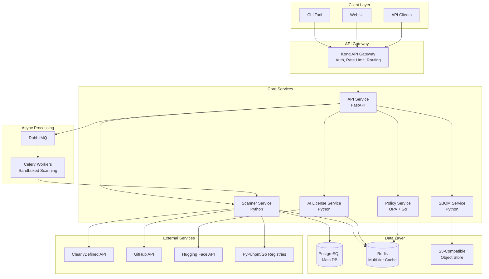
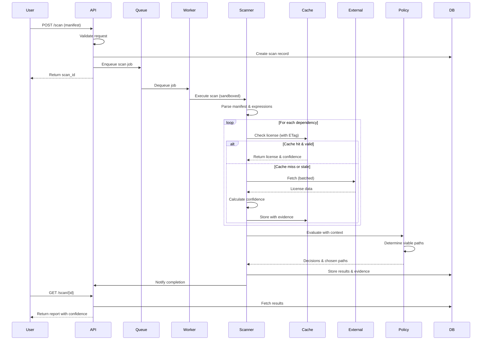

# License Compliance Checker (LCC) v2.0
## Product Requirements Document

**Version:** 1.1  
**Date:** January 2025  
**Status:** Draft (Revised)  
**Repository:** `license-compliance-checker`

---

## Executive Summary

License Compliance Checker (LCC) v2.0 is a cloud-native, open-source license compliance platform specifically designed for the AI era. Building upon existing standards like CycloneDX's ML-BOM and complementing tools like OSS Review Toolkit (ORT), LCC differentiates itself through specialized AI model license interpretation, comprehensive policy templates for emerging licenses, and GPAI compliance artifact generation—all delivered through a modern, developer-friendly interface.

**Core Value Proposition:** An open-source compliance tool that excels at AI/ML license interpretation, provides actionable intelligence for both traditional software and AI model licensing, and generates GPAI compliance artifacts—filling critical gaps in the current tooling landscape.

**Legal Notice:** LCC provides information and analysis tools, not legal advice. Organizations should consult legal counsel for authoritative guidance on license compliance matters.

---

## 1. Vision and Strategic Objectives

### 1.1 Vision Statement
To become the de facto open-source standard for AI-aware license compliance, enabling organizations to confidently navigate the complex intersection of traditional software licensing and emerging AI governance requirements.

### 1.2 Strategic Objectives
- **Year 1:** Establish leadership in AI/ML license detection and interpretation
- **Year 2:** Achieve adoption by 100+ organizations with proven CI/CD integration
- **Year 3:** Become a Linux Foundation or CNCF sandbox project

### 1.3 Success Metrics
- 1,000+ GitHub stars within 12 months
- 50+ active contributors
- Integration into 5+ major open-source AI projects
- 95%+ accuracy on SPDX-standard licenses
- Sub-2-minute scanning for typical ML projects (with cache)

---

## 2. Product Strategy: Phased Delivery Approach

### Phase 1: Foundation (v0.5) - 3 months
**Theme:** "Accurate Detection Engine"
- Core license detection for Python, JavaScript, Go
- SPDX expression parsing (PEP 639 support)
- ClearlyDefined integration with offline cache
- JSON-based policy configuration
- CLI-first approach with consistent exit codes
- Docker packaging with sandboxed scanning

### Phase 2: Intelligence (v0.7) - 2 months
**Theme:** "Smart Policies"
- OPA-based policy engine with context awareness
- Pre-built policy templates with explanations
- CI/CD integrations (GitHub Actions, GitLab CI)
- Basic web UI with legal disclaimers
- Multi-tier caching with intelligent TTLs

### Phase 3: AI-Native (v1.0) - 3 months
**Theme:** "AI License Pioneer"
- Version-aware AI model license detection
- Dataset license analysis with combination effects
- CycloneDX ML-BOM generation (v1.5+)
- Professional web dashboard
- RESTful API endpoints

### Phase 4: Enterprise (v1.5) - 3 months
**Theme:** "Production Ready"
- Multi-tenant support with RBAC
- Comprehensive audit logging
- GPAI compliance assistance (EU template aligned)
- Advanced analytics and reporting
- High availability deployment

---

## 3. Technical Architecture

### 3.1 System Architecture Overview



### 3.2 Component Design

#### 3.2.1 API Service
- **Technology:** FastAPI 0.104+ with Pydantic v2
- **Responsibilities:**
  - Request routing and validation
  - Authentication/authorization (JWT)
  - Rate limiting via Kong integration
  - WebSocket support for real-time scan updates
  - OpenAPI documentation
  - Legal disclaimer headers
- **Key Libraries:**
  - `fastapi[all]`
  - `pydantic`
  - `python-jose[cryptography]`
  - `python-multipart`
  - `slowapi` (rate limiting fallback)

#### 3.2.2 Scanner Service
- **Technology:** Python 3.11+ with asyncio
- **Responsibilities:**
  - Manifest parsing with SPDX expression support
  - Dependency resolution with confidence scoring
  - License detection from multiple sources
  - Evidence collection and source tracking
  - Sandboxed execution for untrusted content
- **Key Libraries:**
  - `aiohttp` (async HTTP with ETag support)
  - `packaging` (version parsing)
  - `spdx-tools` (expression parsing)
  - `pip-licenses`
  - `npm-license-crawler`
  - `go-licenses` (via subprocess)
  - `scancode-toolkit` (sandboxed fallback)

#### 3.2.3 Policy Service
- **Technology:** OPA (Open Policy Agent) with Go sidecar
- **Responsibilities:**
  - Context-aware policy evaluation
  - Dual-license path resolution
  - Rule management and versioning
  - Decision logging with rationale
  - Viable license path determination
- **Key Libraries:**
  - OPA server (container)
  - `opa-python-client`
  - Policy bundles (Rego)

#### 3.2.4 AI License Service
- **Technology:** Python with specialized parsers
- **Responsibilities:**
  - Version-aware model license parsing
  - RAIL restriction extraction
  - Llama license version detection
  - OSAID alignment evaluation
  - Use restriction categorization
- **Key Libraries:**
  - `huggingface-hub`
  - `beautifulsoup4`
  - `pyyaml`
  - Custom RAIL/Llama parsers with version detection

#### 3.2.5 SBOM Service
- **Technology:** Python with standard libraries
- **Responsibilities:**
  - CycloneDX ML-BOM generation (v1.5+)
  - SPDX 2.3 format support
  - Proper PURL generation
  - Format conversion and validation
  - Sigstore/in-toto attestation (future)
- **Key Libraries:**
  - `spdx-tools`
  - `cyclonedx-bom`
  - `packageurl-python`
  - `sigstore` (future)

#### 3.2.6 Web UI
- **Technology:** React 18 with TypeScript
- **Framework:** Next.js 14 with App Router
- **Styling:** Tailwind CSS + shadcn/ui
- **State Management:** TanStack Query + Zustand
- **Components:**
  - Dashboard with legal disclaimers
  - Scan results with confidence indicators
  - Policy editor with inline help
  - Real-time scan progress
  - Evidence drill-down views
  - Report generator with attribution
- **Key Libraries:**
  - `next`
  - `react-query`
  - `recharts` (charts)
  - `monaco-editor` (policy editing)
  - `react-table`

#### 3.2.7 CLI Tool
- **Technology:** Python with Click
- **Features:**
  - Consistent exit codes (0: success, 1: system error, 2: policy violation)
  - Interactive and non-interactive modes
  - JSON/YAML/Markdown output formats
  - Progress bars with ETA
  - Config file support (~/.lcc/config.yaml)
  - Offline mode flag
- **Key Libraries:**
  - `click`
  - `rich` (beautiful output)
  - `httpx` (API client)

#### 3.2.8 Async Workers
- **Technology:** Celery with RabbitMQ
- **Responsibilities:**
  - Long-running scan execution
  - ScanCode sandboxed execution
  - Batch API calls with rate limiting
  - Progress reporting via Redis
- **Security:**
  - Seccomp/AppArmor profiles
  - No egress by default for scanning
  - Resource limits (CPU, memory, time)

### 3.3 Data Architecture

#### 3.3.1 PostgreSQL Schema (Core Tables)

```sql
-- Organizations (multi-tenant)
organizations
- id: UUID
- name: VARCHAR
- created_at: TIMESTAMP
- settings: JSONB

-- Projects
projects
- id: UUID
- org_id: UUID (FK)
- name: VARCHAR
- repository_url: VARCHAR
- settings: JSONB

-- Scans
scans
- id: UUID
- project_id: UUID (FK)
- status: ENUM
- manifest_hash: VARCHAR
- started_at: TIMESTAMP
- completed_at: TIMESTAMP
- metadata: JSONB

-- Components (detected packages/models)
components
- id: UUID
- scan_id: UUID (FK)
- name: VARCHAR
- version: VARCHAR
- ecosystem: VARCHAR
- license_spdx: VARCHAR                    -- Single license ID
- license_expression: TEXT                 -- Full SPDX expression
- detection_confidence: INTEGER            -- 1-100 score
- license_source: ENUM                    -- Primary source
- license_source_order: TEXT[]            -- All sources tried
- evidence: JSONB                         -- URIs, paths, etc.
- normalized_from: TEXT[]                 -- Original forms
- metadata: JSONB

-- Policies
policies
- id: UUID
- org_id: UUID (FK)
- name: VARCHAR
- version: INTEGER
- rego_content: TEXT
- explanations: JSONB                     -- Why rules exist
- is_active: BOOLEAN
- created_at: TIMESTAMP

-- Policy Decisions
policy_decisions
- id: UUID
- scan_id: UUID (FK)
- policy_id: UUID (FK)
- component_id: UUID (FK)
- decision: ENUM
- chosen_license_path: VARCHAR            -- For dual-licensed
- alternative_paths: JSONB               -- Other options
- reasons: JSONB
- created_at: TIMESTAMP

-- Audit Logs
audit_logs
- id: UUID
- org_id: UUID (FK)
- user_id: UUID
- action: VARCHAR
- resource_type: VARCHAR
- resource_id: UUID
- metadata: JSONB
- created_at: TIMESTAMP
```

#### 3.3.2 Redis Cache Structure

```yaml
Cache Keys:
  # License data - longer TTL for stable content
  license:{ecosystem}:{package}:{version} → {license_info}
  TTL: 30 days (rarely changes)
  
  # GitHub license - medium TTL with ETag
  github:{owner}:{repo}:{etag} → {license}
  TTL: 7 days (or until ETag changes)
  
  # ClearlyDefined - medium TTL
  clearly:{type}:{provider}:{namespace}:{name}:{version} → {definition}
  TTL: 7 days
  
  # Registry metadata - shorter TTL
  registry:{ecosystem}:{package} → {metadata}
  TTL: 1 day (rate-limit sensitive)
  
  # Scan progress - ephemeral
  scan:{scan_id}:progress → {percentage}
  TTL: 1 hour
  
  # Rate limiting
  rate:{api_key}:{endpoint} → {count}
  TTL: 60 seconds
  
  # Offline cache snapshots
  offline:spdx:licenses → {full_list}
  offline:clearly:snapshot → {curated_data}
  TTL: Manual update
```

### 3.4 Data Flow Diagrams

#### 3.4.1 Scan Initiation Flow



#### 3.4.2 Dual-License Resolution Flow

```mermaid
flowchart LR
    A[Component with<br/>"MIT OR GPL-3.0"] --> B[Policy Engine]
    B --> C{Context?}
    
    C -->|Internal Use| D[Choose MIT<br/>Lower obligations]
    C -->|SaaS| E[Choose MIT<br/>Avoid copyleft]
    C -->|Distribution| F[Evaluate Both]
    
    F --> G{Policy Rules}
    G -->|MIT Allowed| H[Choose MIT]
    G -->|GPL Required| I[Choose GPL-3.0]
    G -->|Both OK| J[Choose MIT<br/>Document alternatives]
    
    H --> K[Record Decision]
    I --> K
    J --> K
    D --> K
    E --> K
    
    K --> L[Generate Report<br/>Show chosen path<br/>List alternatives]
    
    style B fill:#f9f,stroke:#333,stroke-width:4px
    style K fill:#bbf,stroke:#333,stroke-width:2px
```

### 3.5 Deployment Architecture

#### 3.5.1 Container Structure

```yaml
services:
  # Core Services
  api:
    image: lcc/api:latest
    build: ./services/api
    environment:
      - DATABASE_URL
      - REDIS_URL
      - JWT_SECRET
      - LEGAL_DISCLAIMER="LCC provides information, not legal advice"
    depends_on: [postgres, redis, rabbitmq]
    
  scanner:
    image: lcc/scanner:latest
    build: ./services/scanner
    environment:
      - DATABASE_URL
      - REDIS_URL
      - CLEARLYDEFINED_API_KEY
      - OFFLINE_MODE=${OFFLINE_MODE:-false}
    security_opt:
      - seccomp:scanner-profile.json
      - apparmor:lcc-scanner
    depends_on: [postgres, redis]
    
  worker:
    image: lcc/worker:latest
    build: ./services/worker
    command: celery -A lcc worker --loglevel=info
    environment:
      - CELERY_BROKER_URL=amqp://rabbitmq
      - CELERY_RESULT_BACKEND=redis://redis
    depends_on: [rabbitmq, redis, scanner]
    
  policy:
    image: openpolicyagent/opa:latest-envoy
    volumes:
      - ./policies:/policies:ro
    command: ["run", "--server", "/policies"]
    
  ai_module:
    image: lcc/ai-module:latest
    build: ./services/ai_module
    environment:
      - HF_TOKEN
      - REDIS_URL
      - VERSION_DETECTION=true
      
  # Message Queue
  rabbitmq:
    image: rabbitmq:3.12-management-alpine
    environment:
      - RABBITMQ_DEFAULT_USER=lcc
      - RABBITMQ_DEFAULT_PASS=${RABBITMQ_PASS}
    volumes:
      - rabbitmq_data:/var/lib/rabbitmq
      
  # Infrastructure
  postgres:
    image: postgres:15-alpine
    volumes:
      - postgres_data:/var/lib/postgresql/data
    environment:
      - POSTGRES_DB=lcc
      - POSTGRES_USER
      - POSTGRES_PASSWORD
      
  redis:
    image: redis:7-alpine
    command: ["redis-server", "--appendonly", "yes", "--maxmemory", "2gb", "--maxmemory-policy", "allkeys-lru"]
    volumes:
      - redis_data:/data
      
  # Web UI
  web:
    image: lcc/web:latest
    build: ./web
    environment:
      - NEXT_PUBLIC_API_URL
      - NEXT_PUBLIC_LEGAL_NOTICE="true"
      
  # API Gateway
  kong:
    image: kong:3.4-alpine
    environment:
      - KONG_DATABASE=off
      - KONG_DECLARATIVE_CONFIG=/kong/kong.yml
    ports: 
      - "80:8000"
      - "443:8443"
    volumes:
      - ./kong.yml:/kong/kong.yml:ro
      - ./certs:/kong/certs:ro
    depends_on: [api, web]
```

#### 3.5.2 Development Environment (Conda)

```yaml
name: lcc-dev
channels:
  - conda-forge
  - defaults
dependencies:
  - python=3.11
  - postgresql
  - redis
  - rabbitmq
  - nodejs=20
  - go=1.21
  - pip
  - pip:
    - fastapi[all]
    - celery[redis]
    - pytest
    - black
    - ruff
    - mypy
    - pre-commit
    - spdx-tools
    - packageurl-python
```

---

## 4. User Stories and Requirements

### 4.1 Epic Structure

```
Epic 1: Core License Detection (Phase 1)
├── US-1.1: Scan Python Project (PEP 639)
├── US-1.2: Scan JavaScript Project  
├── US-1.3: Scan Go Project
├── US-1.4: CLI Interface (proper exit codes)
└── US-1.5: Basic Reporting with Confidence

Epic 2: Policy Engine (Phase 2)
├── US-2.1: Define JSON Policy with Context
├── US-2.2: OPA Integration (dual-license aware)
├── US-2.3: Policy Templates with Explanations
├── US-2.4: CI/CD Integration
└── US-2.5: Web Dashboard with Disclaimers

Epic 3: AI Capabilities (Phase 3)
├── US-3.1: Detect AI Models (version-aware)
├── US-3.2: Analyze Datasets (combinations)
├── US-3.3: CycloneDX ML-BOM Generation
├── US-3.4: API Endpoints
└── US-3.5: Advanced Dashboard

Epic 4: Enterprise Features (Phase 4)
├── US-4.1: Multi-tenancy
├── US-4.2: Audit Logging with Evidence
├── US-4.3: GPAI Compliance (EU template)
├── US-4.4: Analytics
└── US-4.5: High Availability
```

### 4.2 Detailed User Stories (Priority Order)

#### US-1.1: Scan Python Project with SPDX Expressions
**Priority:** P0 (Must Have)  
**Points:** 8  
**Sprint:** 1-2

**As a** Python developer  
**I want to** scan my Python project with full SPDX expression support  
**So that** I can understand complex license scenarios including dual-licensing

**Acceptance Criteria:**
1. System accepts requirements.txt, Pipfile.lock, poetry.lock, setup.py, pyproject.toml
2. Parses PEP 639 license expressions from metadata
3. Detects direct dependencies with 100% accuracy
4. Detects transitive dependencies with 95% accuracy
5. Calculates confidence scores for each detection
6. Collects evidence URIs for audit trail
7. Completes scan of 100 packages in <30 seconds with cache
8. Outputs JSON with package, version, expression, confidence, evidence

**Test Scenarios:**
```gherkin
Scenario: Parse SPDX expression from PEP 639
  Given a package with license "MIT OR Apache-2.0"
  When scanning the package
  Then system stores full expression
  And identifies both license options
  And marks confidence as "high" from PyPI metadata

Scenario: Handle missing license with fallback
  Given a package with no license in PyPI
  When scanning the package
  Then system checks GitHub repository with ETag
  And falls back to ClearlyDefined
  And uses ScanCode in sandboxed worker if needed
  And marks confidence as "medium" or "low"
  And stores evidence chain

Scenario: Detect complex expressions
  Given a package with "GPL-3.0-only WITH Classpath-exception-2.0"
  When parsing the license
  Then system identifies base license and exception
  And stores normalized expression
```

---

#### US-2.1: Context-Aware JSON Policy with Dual-License Support
**Priority:** P0 (Must Have)  
**Points:** 5  
**Sprint:** 3

**As a** team lead  
**I want to** define policies that handle dual-licensed packages intelligently  
**So that** the tool chooses appropriate license paths based on usage context

**Acceptance Criteria:**
1. JSON schema supports license expressions
2. Policies define path selection strategies
3. Context (internal/SaaS/distribution) influences decisions
4. SSPL explicitly marked as non-OSI
5. Override capabilities with audit trail
6. Policy explanations included
7. Validation on load

**Policy Schema Example:**
```json
{
  "version": "1.0",
  "name": "enterprise-standard",
  "disclaimer": "Consult legal counsel for authoritative guidance",
  "contexts": {
    "internal": {
      "allow": ["MIT", "Apache-2.0", "BSD-*"],
      "deny": ["SSPL-1.0"],  
      "deny_reasons": {
        "SSPL-1.0": "Not OSI-approved, legal review required"
      },
      "dual_license_preference": "most_permissive"
    },
    "saas": {
      "allow": ["MIT", "Apache-2.0", "BSD-*"],
      "deny": ["GPL-*", "AGPL-*", "SSPL-1.0"],
      "deny_reasons": {
        "AGPL-*": "Network copyleft incompatible with SaaS model",
        "SSPL-1.0": "Not OSI-approved, service restriction"
      },
      "review": ["LGPL-*", "MPL-*"],
      "review_reasons": {
        "LGPL-*": "Dynamic linking may be acceptable"
      },
      "dual_license_preference": "avoid_copyleft"
    }
  }
}
```

---

#### US-3.1: Version-Aware AI Model License Detection
**Priority:** P0 (Must Have for Phase 3)  
**Points:** 8  
**Sprint:** 6-7

**As an** ML engineer  
**I want to** accurately detect AI model licenses with version-specific terms  
**So that** I understand exact restrictions that apply to my model version

**Acceptance Criteria:**
1. Detects Llama 2 vs Llama 3 license differences
2. Parses exact clauses from license text (not assumptions)
3. Extracts specific RAIL restrictions
4. Categorizes against OSAID (as alignment check, not label)
5. Shows exact restriction text in UI
6. Links to source license documents
7. Handles model versioning correctly

**Test Scenarios:**
```gherkin
Scenario: Differentiate Llama versions
  Given a project using "meta-llama/Llama-2-7b"
  When scanning for model licenses
  Then system detects Llama 2 Community License
  And extracts "700M MAU" clause if present
  And does NOT assume Llama 3 terms

Scenario: Extract RAIL restrictions
  Given a model with BigCode OpenRAIL-M license
  When analyzing license
  Then system extracts specific use restrictions
  And shows exact prohibited uses from text
  And categorizes as "use-restricted (not OSI-approved)"
  And provides link to full license
```

---

#### US-3.2: Dataset License Analysis with Combinations
**Priority:** P1 (Should Have)  
**Points:** 5  
**Sprint:** 7

**As a** data scientist  
**I want to** understand dataset license implications including combinations  
**So that** I can ensure compliant model training with mixed datasets

**Acceptance Criteria:**
1. Detects all Creative Commons variants
2. Analyzes combination effects (e.g., CC-BY-SA propagation)
3. Generates required attribution text
4. Flags non-commercial restrictions clearly
5. Handles dataset cards from Hugging Face
6. Tracks ShareAlike obligations through pipeline

**Combination Rules:**
| Dataset A | Dataset B | Result | Note |
|-----------|-----------|--------|------|
| CC0 | Any | Follow B | CC0 has no requirements |
| CC BY | CC BY-SA | CC BY-SA | ShareAlike propagates |
| CC BY | CC BY-NC | CC BY-NC | Non-commercial restricts |
| CC BY-SA | CC BY-NC-SA | CC BY-NC-SA | Most restrictive wins |

---

#### US-3.3: CycloneDX ML-BOM Generation
**Priority:** P0 (Must Have for Phase 3)  
**Points:** 8  
**Sprint:** 7-8

**As a** compliance officer  
**I want to** generate standard CycloneDX ML-BOM with proper types  
**So that** I can provide supply chain transparency for AI systems

**Acceptance Criteria:**
1. Generates valid CycloneDX 1.5+ format
2. Uses correct `machine-learning-model` component type
3. Includes proper PURLs (no invented schemes)
4. Adds ML-specific metadata
5. Validates against official schema
6. Supports Sigstore signing (documented approach)
7. Includes confidence scores as properties

**CycloneDX ML-BOM Example (corrected):**
```json
{
  "bomFormat": "CyclonDX",
  "specVersion": "1.5",
  "serialNumber": "urn:uuid:3e671685-8536-4ef3-854f-c5c2c5c2c5c2",
  "version": 1,
  "metadata": {
    "timestamp": "2025-01-15T10:00:00Z",
    "tools": [{"name": "LCC", "version": "1.0.0"}]
  },
  "components": [
    {
      "type": "library",
      "bom-ref": "pkg:pypi/django@4.2.0",
      "name": "django",
      "version": "4.2.0",
      "licenses": [
        {"license": {"id": "BSD-3-Clause"}}
      ],
      "properties": [
        {"name": "lcc:confidence", "value": "95"},
        {"name": "lcc:evidence", "value": "pypi-metadata"}
      ]
    },
    {
      "type": "machine-learning-model",
      "bom-ref": "pkg:huggingface/bert-base-uncased@main",
      "name": "bert-base-uncased",
      "version": "main",
      "licenses": [
        {"license": {"id": "Apache-2.0"}}
      ],
      "properties": [
        {"name": "model:architecture", "value": "transformer"},
        {"name": "model:task", "value": "masked-lm"}
      ]
    }
  ]
}
```

---

#### US-4.3: GPAI Compliance with EU Template
**Priority:** P2 (Could Have)  
**Points:** 8  
**Sprint:** 10-11

**As an** AI governance lead  
**I want** GPAI documentation aligned with official EU templates  
**So that** we meet regulatory requirements for model providers

**Acceptance Criteria:**
1. Implements official EU training-data summary template (July 2025)
2. Generates sections per EU guidance
3. Includes required granularity levels
4. Distinguishes provider vs deployer obligations
5. Stores supplier attestations for deployers
6. Exports in required formats
7. Includes template version tracking

**GPAI Template Sections (per EU guidance):**
- Data sources and collection methods
- Data processing and preparation
- Personal data usage and legal basis  
- Copyright compliance measures
- Data quality and bias assessment
- Opt-out mechanisms (where applicable)

---

## 5. Non-Functional Requirements

### 5.1 Performance Requirements
- **Scan Speed**: <30 seconds for 100 dependencies (warm cache)
- **Deep Scan**: Async processing with progress for ScanCode fallback
- **API Response**: P95 latency <500ms for cached queries
- **Concurrent Scans**: 100 simultaneous via queue workers
- **Cache Hit Rate**: >80% for common packages
- **Batch Processing**: API calls batched to respect rate limits

### 5.2 Security Requirements
- **Sandboxing**: ScanCode runs in isolated container (seccomp/AppArmor)
- **Authentication**: JWT with refresh tokens
- **Legal Disclaimer**: Prominent notices in UI and API responses
- **Encryption**: TLS 1.3 for transit, AES-256 for rest
- **Offline Mode**: Full operation with cached data
- **No Egress**: Scanner workers have no internet by default

### 5.3 Reliability Requirements
- **Availability**: 99.9% uptime (Phase 4)
- **Graceful Degradation**: Continues with cache if externals down
- **Queue Persistence**: RabbitMQ with durable queues
- **Evidence Retention**: Permanent storage of detection evidence
- **ETag Support**: Efficient cache invalidation for GitHub
- **Error Handling**: Clear messages with remediation steps

### 5.4 Compliance and Standards
- **SPDX**: Full expression support per spec
- **CycloneDX**: ML-BOM compliance (v1.5+)  
- **PEP 639**: Python license expression support
- **ISO/IEC 5230**: OpenChain alignment documentation
- **PURL**: Proper Package URL specification
- **OSAID**: Evaluation capability (not certification)

### 5.5 Exit Codes (CLI)
- **0**: Success, all checks passed
- **1**: System error (network, config, etc.)
- **2**: Policy violation detected
- **3**: Invalid input or arguments

---

## 6. Testing Strategy

### 6.1 Test Coverage Requirements
- **Unit Tests**: >80% code coverage
- **License Corpus**: 1000+ packages with known licenses
- **Expression Tests**: All SPDX operators and exceptions
- **Dual-License Tests**: Path selection validation
- **Confidence Tests**: Score accuracy validation
- **Sandbox Tests**: Isolation verification

### 6.2 Compliance Test Suite
```gherkin
Feature: SPDX Expression Parsing
  Scenario: Complex expression with exception
    Given license string "GPL-3.0-only WITH Classpath-exception-2.0"
    When parsed
    Then base license is "GPL-3.0-only"
    And exception is "Classpath-exception-2.0"
    
  Scenario: Dual license with preference
    Given license "(MIT OR GPL-2.0)" and context "saas"  
    When policy evaluates
    Then chosen path is "MIT"
    And reason is "avoid_copyleft"
    And alternative "GPL-2.0" is documented
```

---

## 7. Documentation Requirements

### 7.1 User Documentation
- **Legal Disclaimers**: Prominent notice that LCC provides information, not legal advice
- **License Expression Guide**: SPDX syntax and examples
- **Policy Writing**: Context strategies and dual-license handling
- **OSAID Alignment**: How evaluation works (not certification)
- **Offline Mode**: Setup and maintenance procedures

### 7.2 Standards References
- Link to SPDX license list and expression spec
- Link to CycloneDX ML-BOM documentation
- Link to PEP 639 for Python users
- Link to EU GPAI templates and guidance
- Link to primary sources for copyleft licenses (FSF)

---

## 8. Implementation Priorities (Revised)

### Must-Fix Before v1.0
- [x] SPDX expression support throughout
- [x] Confidence scoring and evidence tracking
- [x] Version-aware AI license parsing
- [x] Dual-license path selection logic
- [x] Legal disclaimers in all interfaces
- [x] Sandboxed scanning for untrusted content
- [x] Queue-based async processing
- [x] Proper PURL generation (no invented schemes)
- [x] SSPL marked as non-OSI in templates

### Should-Fix Before v1.0
- [x] Multi-tier caching with intelligent TTLs
- [x] ETag support for GitHub API
- [x] Dataset combination analysis
- [x] Policy explanations inline
- [x] Offline mode documentation
- [x] OpenChain alignment checklist

### Post-v1.0 Enhancements
- [ ] Sigstore attestation for SBOMs
- [ ] Full EU GPAI template implementation
- [ ] Advanced linkage analysis (static vs dynamic)
- [ ] License compatibility matrix visualization
- [ ] Historical license tracking across versions

---

## 9. Competitive Differentiation (Revised)

### Unique Strengths
1. **AI-First Design**: Purpose-built for AI/ML licensing challenges
2. **Version-Aware Parsing**: Detects Llama 2 vs 3, RAIL variants
3. **GPAI Ready**: Templates aligned with EU requirements
4. **Developer UX**: Clear confidence scores, evidence trails
5. **Policy Intelligence**: Context-aware dual-license resolution

### Complementary to Existing Tools
- **vs ORT**: Simpler setup, AI-focused, better developer UX
- **vs CycloneDX tools**: Adds policy layer and AI interpretation
- **vs ScanCode**: Builds on top for full compliance workflow
- **vs Commercial SCA**: Open source, transparent scoring, AI-native

---

## 10. Success Metrics and KPIs (Updated)

### Technical Quality
- **SPDX Expression Accuracy**: >99% for standard expressions
- **License Detection**: >95% accuracy on curated corpus
- **Confidence Calibration**: Scores correlate with accuracy
- **Cache Efficiency**: >80% hit rate after warm-up
- **Sandbox Security**: Zero escapes in testing

### Adoption Indicators
- **Developer Satisfaction**: >4.0/5 user rating
- **CI/CD Integration**: 100+ active pipelines
- **Policy Templates**: 20+ community contributions
- **Documentation**: <10 minutes to first successful scan
- **Support**: <24 hour response for critical issues

---

## 11. Risk Register (Updated)

| Risk | Probability | Impact | Mitigation |
|------|------------|--------|------------|
| SPDX expression complexity | Medium | High | Comprehensive test suite, gradual rollout |
| AI license evolution | High | Medium | Version detection, regular updates, flexible parsers |
| GPAI template changes | Medium | Medium | Version tracking, template updates, clear disclaimers |
| Dual-license misinterpretation | Low | High | Clear documentation, chosen path visibility, legal disclaimers |
| ScanCode sandbox escape | Low | Critical | Defense in depth, security audits, resource limits |
| Cache invalidation bugs | Medium | Low | ETag support, TTL tuning, manual refresh option |

---

## 12. References and Standards

### Core Standards
- [SPDX License List and Expressions](https://spdx.org/licenses/)
- [CycloneDX ML-BOM v1.5+](https://cyclonedx.org/specification/overview/)
- [PEP 639 - Python License Expressions](https://peps.python.org/pep-0639/)
- [Package URL Specification](https://github.com/package-url/purl-spec)
- [ISO/IEC 5230:2020 - OpenChain](https://www.iso.org/standard/81039.html)

### AI and Regulatory
- [OSI Open Source AI Definition v1.0](https://opensource.org/ai/open-source-ai-definition)
- [EU GPAI Training Data Template](https://digital-strategy.ec.europa.eu/en/library/explanatory-notice-and-template-public-summary-training-content-general-purpose-ai-models)
- [BigCode OpenRAIL-M](https://www.bigcode-project.org/docs/pages/bigcode-openrail/)
- [Meta Llama Licenses](https://ai.meta.com/llama/license/)

### Implementation
- [OPA/Rego Documentation](https://www.openpolicyagent.org/docs/)
- [ClearlyDefined API](https://docs.clearlydefined.io/)
- [ScanCode Toolkit](https://github.com/aboutcode-org/scancode-toolkit)
- [Sigstore/Cosign for Attestation](https://docs.sigstore.dev/)
